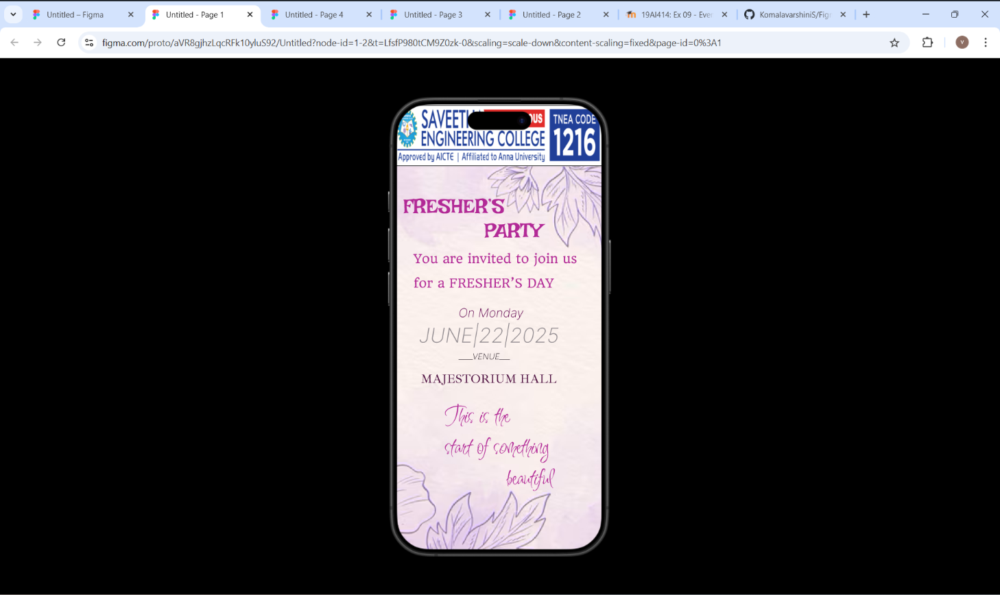
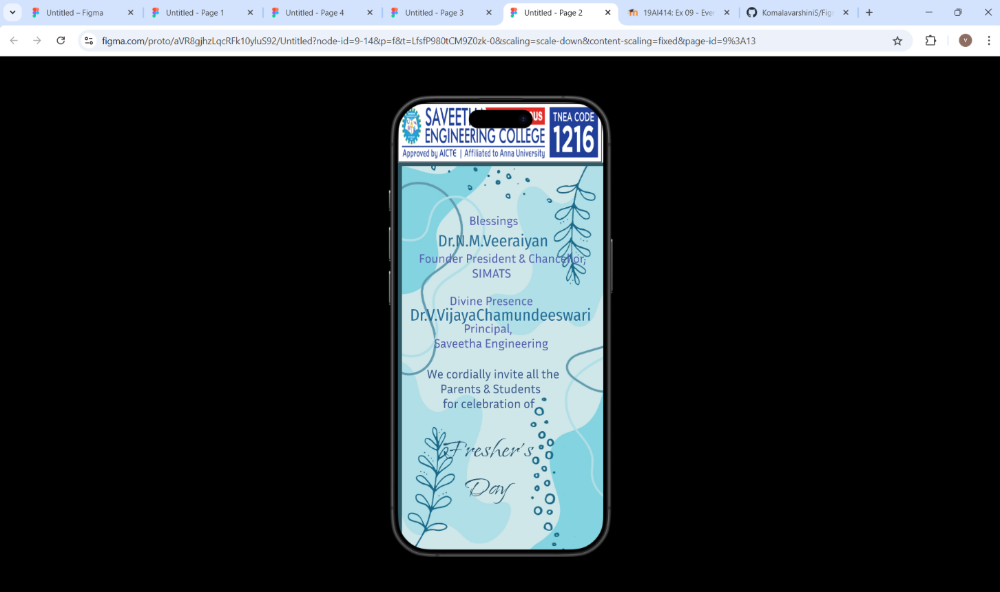
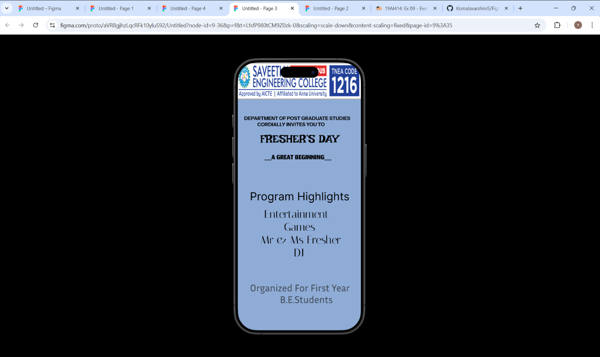
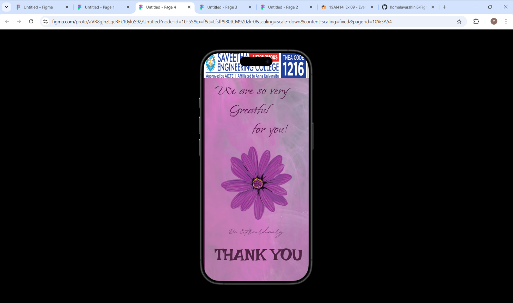

# Ex09 Event Registration Web Application
## Date: 21.11.25

## AIM:
To design, develop and deploy a web application for event registration.

## DESIGN STEPS:

### Step 1:
Create a new frame.

### Step 2:
Select any one preset size of your choice.

### Step 3:
Select the shapes you need.

### Step 4:
Import images as needed.

### Step 5:
Create pages based on your need and link them.

### Step 6:

Validate the HTML and CSS code.

### Step 6:

Publish the website in the given URL.

## DESIGN TOOL:
Figma

## CODE:
### page 1
```
HTML
<div class="container--0-">
  
  <div class="text-0-1-2">FRESHER’S</div>
  <div class="text-0-1-3">PARTY</div>
  <div class="text-0-1-4">You are invited to join us for a FRESHER’S DAY</div>
  <div class="text-0-1-5">On Monday</div>
  <div class="text-0-1-6">JUNE|22|2025</div>
  <div class="text-0-1-7">____VENUE___</div>
  <div class="text-0-1-8">MAJESTORIUM HALL</div>
  <div class="text-0-1-9">
    This is the <br />start of something<br />
    beautiful
  </div>
</div>

CSS
.container--0- {
  position: absolute;
  left: -201px;
  top: -461px;
  width: 402px;
  height: 874px;
  background-color: #dea1ddb0;
  justify-content: start;
  align-items: start;
}
.text-0-1-2 {
  width: 200px;
  height: 48px;
  color: #b22996;
  font-size: 40px;
  font-family: Irish Grover, "Regular";
  font-weight: 400;
  text-align: left;
  vertical-align: top;
}
.text-0-1-3 {
  width: 153px;
  height: 55px;
  color: #b22996;
  font-size: 40px;
  font-family: Irish Grover, "Regular";
  font-weight: 400;
  text-align: left;
  vertical-align: top;
}
.text-0-1-4 {
  width: 358px;
  height: 98px;
  color: #b22996;
  font-weight: 400;
  text-align: left;
  vertical-align: top;
}
.text-0-1-5 {
  width: 175px;
  height: 15px;
  color: #60044e;
  font-size: 24px;
  font-family: Inter, "Extra Light Italic";
  font-weight: 200;
  text-align: left;
  vertical-align: top;
}
.text-0-1-6 {
  width: 298px;
  height: 57px;
  color: #8d878c;
  font-size: 40px;
  font-family: Inter, "Extra Light Italic";
  font-weight: 200;
  text-align: left;
  vertical-align: top;
}
.text-0-1-7 {
  width: 101px;
  height: 19px;
  color: #0c010af7;
  font-size: 16px;
  font-family: Inter, "Extra Light Italic";
  font-weight: 200;
  text-align: left;
  vertical-align: top;
}
.text-0-1-8 {
  width: 329px;
  height: 30px;
  color: #450538f7;
  font-size: 24px;
  font-family: Ibarra Real Nova, "Regular";
  font-weight: 400;
  text-align: left;
  vertical-align: top;
}
.text-0-1-9 {
  width: 213px;
  height: 183px;
  color: #b22996;
  font-size: 48px;
  font-family: Inspiration, "Regular";
  font-weight: 400;
  text-align: left;
  vertical-align: top;
}
```
### page 2
```
HTM
<div class="container--0-">
  
  <div class="text-0-1-4">
    Fresher’s<br />
    Day
  </div>
  <div class="text-0-1-5">Blessings</div>
  <div class="text-0-1-6">Dr.N.M.Veeraiyan</div>
  <div class="text-0-1-7">
    Founder President &#x26; Chancellor,<br />
    SIMATS
  </div>
  <div class="text-0-1-8">Divine Presence</div>
  <div class="text-0-1-9">Dr.V.VijayaChamundeeswari</div>
  <div class="text-0-1-10">Principal,<br />Saveetha Engineering</div>
  <div class="text-0-1-11">
    We cordially invite all the<br />
    Parents &#x26; Students <br />
    for celebration of <br /><br />
  </div>
</div>
<div class="text--0-"></div>

CSS
.container--0- {
  position: absolute;
  left: -201px;
  top: -437px;
  width: 402px;
  height: 874px;
  background-color: #69c2dd75;
  justify-content: start;
  align-items: start;
}
.text-0-1-1 {
  height: 76px;
  color: #000000;
  font-size: 32px;
  font-family: Fira Sans Condensed, "Regular";
  font-weight: 400;
  text-align: left;
  vertical-align: top;
}
.text-0-1-2 {
  height: 38px;
  color: #185e74b8;
  font-size: 32px;
  font-family: Inria Sans, "Regular";
  font-weight: 400;
  text-align: left;
  vertical-align: top;
}
.text-0-1-4 {
  width: 180px;
  height: 148px;
  color: #0d3d5bd6;
  font-size: 64px;
  font-family: Island Moments, "Regular";
  font-weight: 400;
  text-align: left;
  vertical-align: top;
}
.text-0-1-5 {
  width: 109px;
  height: 36px;
  color: #535cae;
  font-size: 24px;
  font-family: Inria Sans, "Regular";
  font-weight: 400;
  text-align: left;
  vertical-align: top;
}
.text-0-1-6 {
  width: 224px;
  height: 38px;
  color: #095788d6;
  font-size: 32px;
  font-family: Fira Sans Condensed, "Regular";
  font-weight: 400;
  text-align: left;
  vertical-align: top;
}
.text-0-1-7 {
  width: 327px;
  height: 58px;
  color: #535cae;
  font-size: 24px;
  font-family: Inria Sans, "Regular";
  font-weight: 400;
  text-align: left;
  vertical-align: top;
}
.text-0-1-8 {
  width: 164px;
  height: 129px;
  color: #535cae;
  font-size: 24px;
  font-family: Inria Sans, "Regular";
  font-weight: 400;
  text-align: left;
  vertical-align: top;
}
.text-0-1-9 {
  width: 354px;
  height: 144px;
  color: #095788d6;
  font-size: 32px;
  font-family: Fira Sans Condensed, "Regular";
  font-weight: 400;
  text-align: left;
  vertical-align: top;
}
.text-0-1-10 {
  width: 224px;
  height: 180px;
  color: #535cae;
  font-size: 24px;
  font-family: Inria Sans, "Regular";
  font-weight: 400;
  text-align: left;
  vertical-align: top;
}
.text-0-1-11 {
  width: 275px;
  height: 145px;
  font-size: 24px;
  font-family: Inria Sans, "Regular";
  font-weight: 400;
  text-align: left;
  vertical-align: top;
}
.text--0- {
  width: 209px;
  height: 25px;
  color: #0d3d5bd6;
  font-size: 64px;
  font-family: Island Moments, "Regular";
  font-weight: 400;
  text-align: left;
  vertical-align: top;
}
```
### page 3
```
HTML

<div class="text--0-">
  DEPARTMENT OF POST GRADUATE STUDIES<br />
  CORDIALLY INVITES YOU TO
</div>
<div class="text--0-">FRESHER’S DAY</div>
<div class="text--0-">__A GREAT BEGINNING__</div>
<div class="text--0-">Program Highlights</div>
<div class="text--0-">
  Entertainment<br />
  Games<br />
  Mr &#x26; Ms Fresher<br />
  DJ
</div>
<div class="text--0-">
  Organized For First Year <br />
  B.E.Students
</div>

CSS
.text--0- {
  width: 333px;
  height: 76px;
  color: #252626b8;
  font-size: 32px;
  font-family: Inria Sans, "Regular";
  font-weight: 400;
  text-align: left;
  vertical-align: top;
}
```
### page 4
```
HTML
<div class="container--0-">
  
  <div class="text-0-1-2">
    We are so very<br />
    Greatful<br />
    for you!
  </div>
  <div class="text-0-1-3">THANK YOU</div>
  
</div>

CSS
.container--0- {
  position: absolute;
  left: -201px;
  top: -437px;
  width: 402px;
  height: 874px;
  background-color: #c45dad91;
  justify-content: start;
  align-items: start;
}
.text-0-1-2 {
  width: 280px;
  height: 230px;
  color: #511447;
  font-size: 64px;
  font-family: Island Moments, "Regular";
  font-weight: 400;
  text-align: left;
  vertical-align: top;
}
.text-0-1-3 {
  width: 336px;
  height: 77px;
  color: #4e2343;
  font-size: 64px;
  font-family: Irish Grover, "Regular";
  font-weight: 400;
  text-align: left;
  vertical-align: top;
}
```

## OUTPUT:





## RESULT:
The program to design, develop and deploy a web application for event registration is completed successfully.
